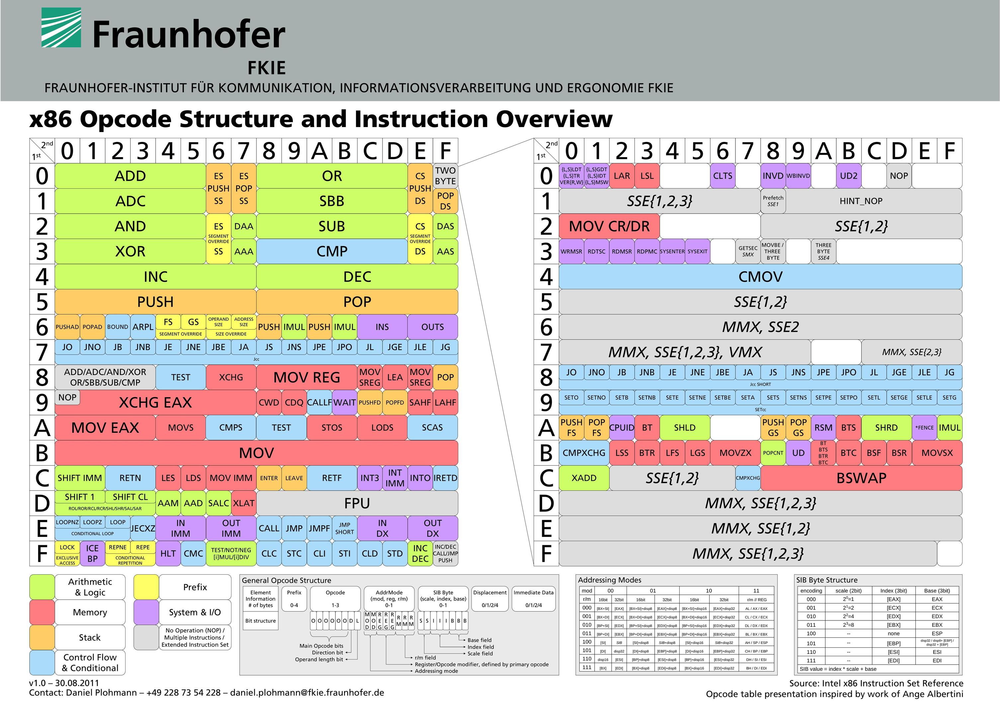

# How Does a Machine Think?

Humans think in words.  These words are formed from a number of symbols which come together to
form an intelligent meaning.  Machines support a number of operations that it can use to do computation.
These operations are controlled by electrical signals, and the presence or absence of an electrical
signal is how it thinks.

These operations are expressed in a form that humans can understand in the form of an **instruction set**.
Each instruction has an **opcode** or *operation code* which is a unique numberical representation that the machine can decode to 
understand what instruction it is supposed to perform.  

{width=650, align=right}

The diagram here shows the instruction set for x86, originally developed by Intel.
This is the most widely used instruction set across the industry along with arm.  You can
check what instruction set your computer uses by finding the processor information and
looking up the specs of the processor.  Likely, if it is an Intel chip it uses x86.

The binary representation (written using only 1s and 0s) of these instructions is called *machine language*.  As mentioned
earlier, machines can only understand the presence or absence of an electrical signal.
This is represented notationally as 0 for absence and 1 for presence.  In order for a machine
to understand anything, it must be translated down to machine language.

But, humans don't understand in 1s and 0s, we understand with words.  So humans write in
*assembly language* which uses the human readable instructions and other formal mechanisms
and then feeds it into an *assembler* to translate it down to machine language that the computer can understand.

# Higher Level Languages

The problem with writing in languages based on the processor instruction set is that the code can only ever
run on that specific processor.  Processors based on other instructions have no way to understand the code.

